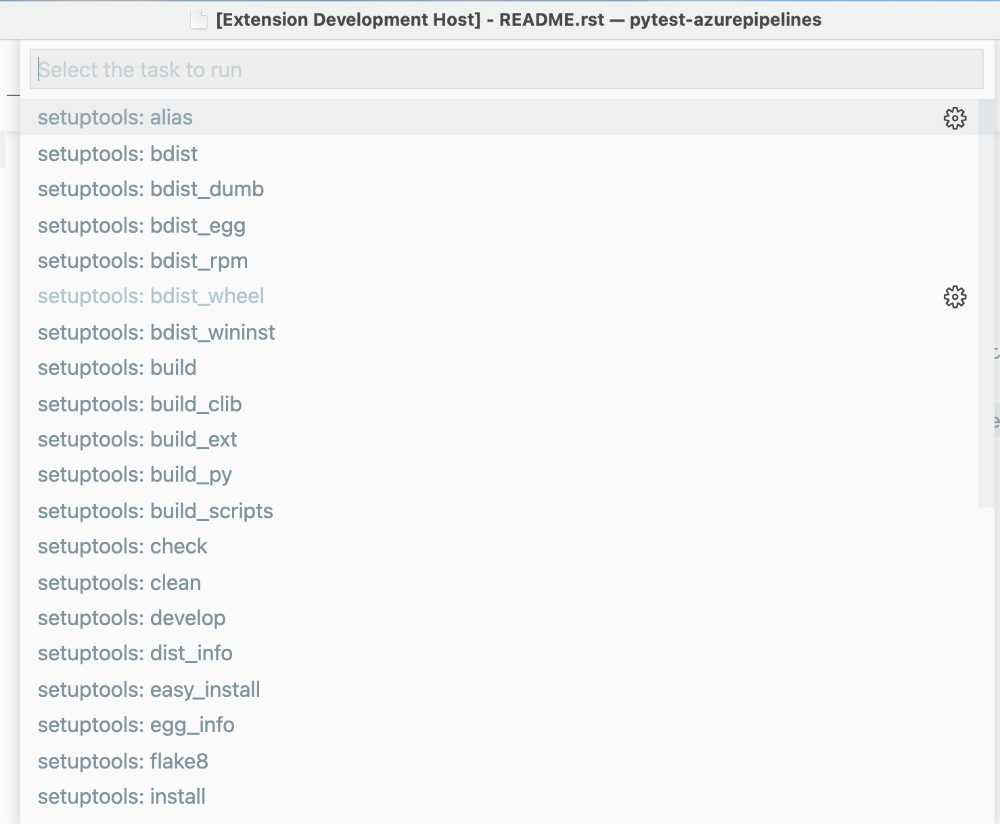
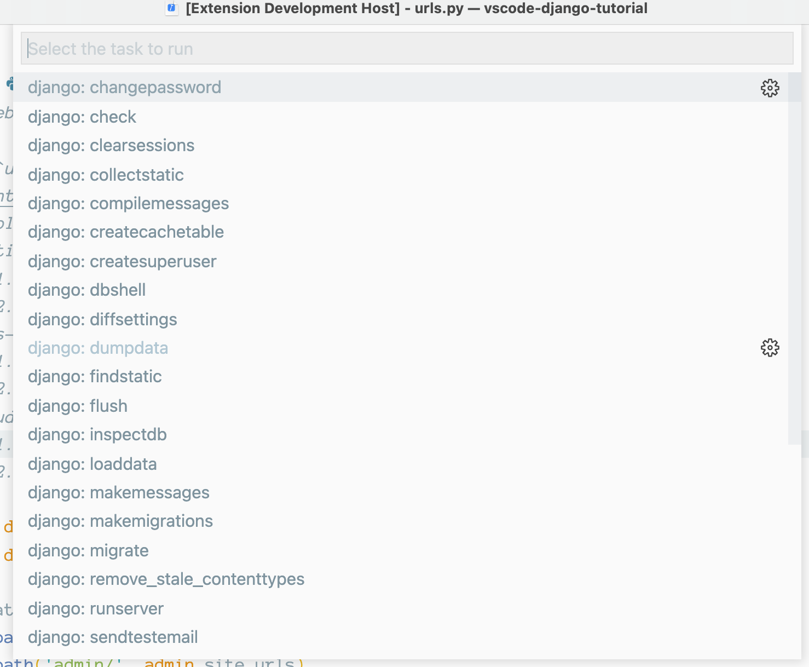

# python-task-provider

An extension for VS Code that provides tasks to the VS Code Task system for Python applications.

## Setuptools Task Provider

Automatically discovers available commands for setuptools (`setup.py`) and exposes them to the **Run Task** command:




## Django Task Provider

Automatically discovers available subcommands for Django (`manage.py`) and exposes them to the **Run Task** command:



## Calling from tasks.json

If you want to save the task and recall it, add it to `tasks.json`:

```javascript
{
    "version": "2.0.0",
    "tasks": [
        {
            "type": "django",
            "task": "check",
            "label": "django: check"
        },
        {
            "type": "django",
            "task": "collectstatic",
            "label": "django: collectstatic"
        }
    ]
}
```

The type is either `django` or `setuptools`, and the `task` is the subcommand. You can optionally provide a property `file` to be specific about which `setup.py` or `manage.py` to use (if you have more than 1).

If you have the Task Explorer UI extension, it will make these available as UI shortcuts:

