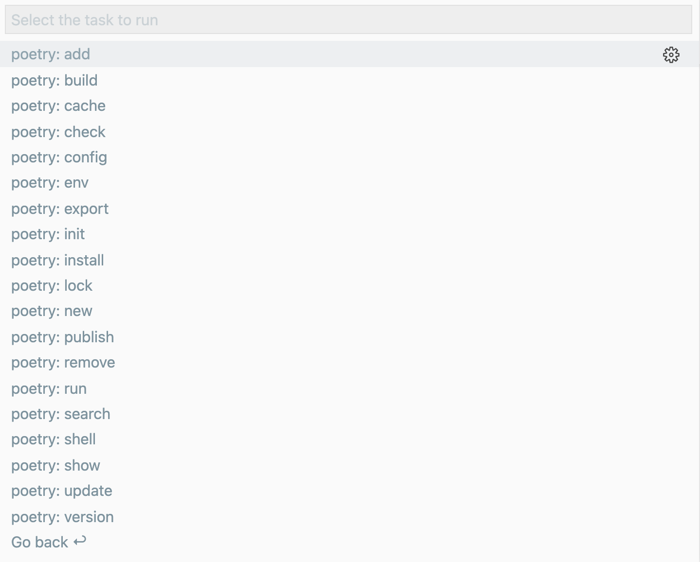
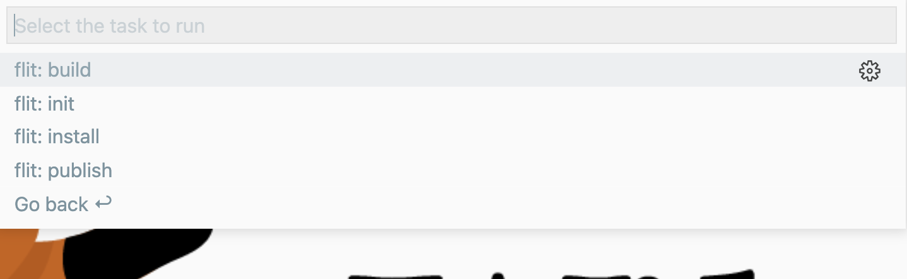
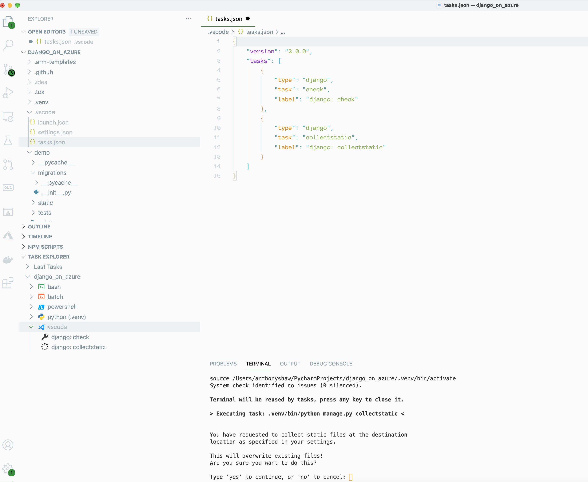

# python-task-provider

An extension for VS Code that provides tasks to the VS Code Task system for Python applications.

 - Discovers setuptools (`setup.py`) sub-commands
 - Discovers Django `manage.py` and makes all Django commands available as tasks
 - Looks at `pyproject.toml` and detects both flit and poetry then makes those tasks available

## Setuptools Task Provider

Automatically discovers available commands for setuptools (`setup.py`) and exposes them to the **Run Task** command:


## Django Task Provider

Automatically discovers available subcommands for Django (`manage.py`) and exposes them to the **Run Task** command:


## Poetry Task Provider

The poetry discovery script will look for the existence of `pyproject.toml` and the `[tool.poetry]` section within it.

It will then make available the following commands as tasks:

"new", "init", "install", "update", "add", "remove", "show", "build", "publish", "config", "run", "shell", "check", "search", "lock", "version", "export", "env", "cache"



## Flit Task Provider

The flit discovery script will look for the existence of `pyproject.toml` and the `[tool.flit.*]` section within it.

It will then make available the following commands as tasks:

"build", "publish", "install", "init"



## Calling from tasks.json

If you want to save the task and recall it, add it to `tasks.json`:

```javascript
{
    "version": "2.0.0",
    "tasks": [
        {
            "type": "django",
            "task": "check",
            "label": "django: check"
        },
        {
            "type": "django",
            "task": "collectstatic",
            "label": "django: collectstatic"
        }
    ]
}
```

The type is either `django` or `setuptools`, and the `task` is the subcommand. You can optionally provide a property `file` to be specific about which `setup.py` or `manage.py` to use (if you have more than 1).

## Providing additional arguments to tasks

Any tasks which require command-line arguments can be given arguments using the `args` array:

```javascript
{
    "version": "2.0.0",
    "tasks": [
        {
            "type": "setuptools",
            "task": "build",
            "args": ["--generator", "ninja"]
        }
    ]
}
```

## Task Explorer UI Support

If you have the Task Explorer UI extension, it will make these available as UI shortcuts:

